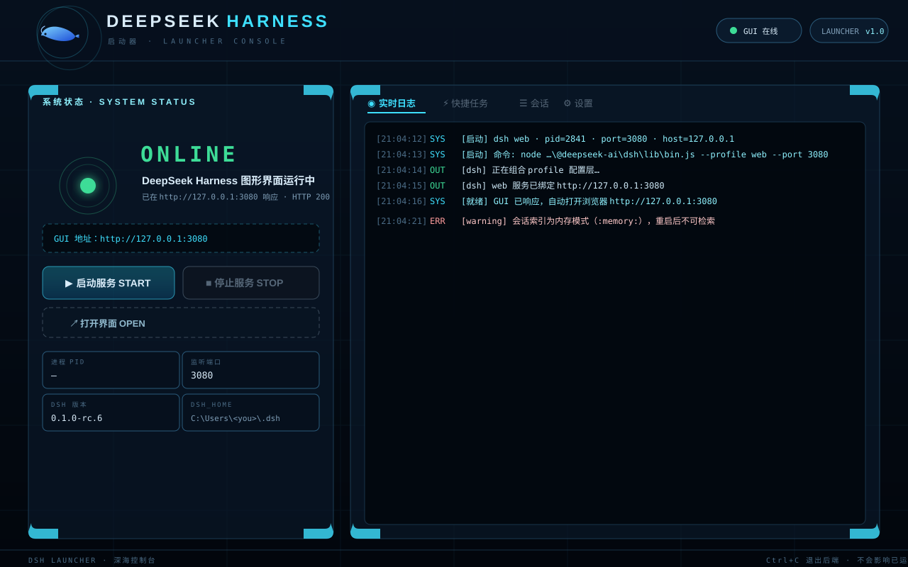

<div align="center">

# 🐋 DeepSeek Harness 启动器

**DeepSeek Harness (DSH) 本地启动器：一键启停 `dsh web`、运行 headless 任务、日志，深海控制台风格界面。**

[English](README.en.md) · 中文


[](https://github.com/levi52/dsh-launcher/actions)
[](https://www.deepseek.com/harness/)

</div>



---

## 特性

- 🚀 **一键启停**：以子进程拉起 `dsh web`（`--profile web --port <port> --host <host>`），停止时整树终止；启动成功自动打开浏览器
- 🟢 **实时状态**：Web UI 在线/离线/启动中/停止中四种状态信标，PID、端口、DSH 版本、DSH_HOME、profiles 一目了然
- 📡 **日志**：SSE 流式推送 stdout/stderr，终端风格渲染，支持 ANSI 颜色、自动滚动、清空
- ⚡ **快捷任务**：输入任务 → `dsh --profile headless "<task>"` 运行一次性持久化会话，实时输出 + 退出码，可随时取消
- ☰ **会话浏览**：列出 `$DSH_HOME/sessions` 下的工作区会话，一键在资源管理器中打开
- ⛔ **强制停止**：「停止服务」只作用于启动器自己拉起的进程；「强制停止端口进程」可查找并终止占用端口的任意进程（带二次确认）
- 🔁 **多实例接管**：多个启动器实例通过共享登记表（`$DSH_HOME/dsh-launcher/claims.json`）识别「这个 Web UI 是谁启动的」，另一实例可一键「接管控制」后正常停止，不再只能看着
- 🧩 **自动探测 dsh CLI**：依次查找全局 npm 安装、npx 缓存，兜底 `npx -y @deepseek-ai/dsh`，也支持手动指定
- 🔔 **安装与更新检查**：显示 dsh 是否已安装及其来源（npx 缓存 / 全局安装），自动比对 npm registry 最新版本（1 小时缓存），发现新版本时高亮提示，可一键手动复查
- 🔒 **本地安全**：仅监听 `127.0.0.1`，不采集任何密钥，配置留在本机

## 快速开始

### 环境要求

- **Node.js ≥ 18**（开发环境为 v22）
- 已安装或可通过 npx 获取的 [DeepSeek Harness](https://github.com/deepseek-ai/deepseek-harness)（`@deepseek-ai/dsh`）

### 方式一：直接运行（无需安装）

```bash
git clone https://github.com/levi52/dsh-launcher.git
cd dsh-launcher
npm start          # 等价于 node launcher.js
```

浏览器自动打开控制台：<http://127.0.0.1:3090>。

### 方式二：Windows 双击

双击 `start-launcher.bat` 即可，关闭窗口即退出后端。

想带鲸鱼图标启动？双击 `create-desktop-shortcut.bat`，在桌面创建一个指向启动器的快捷方式（图标来自 `public/favicon.ico`）。

### 方式三：npx 临时运行（可选）

```bash
npx dsh-launcher
```

## 界面说明

| 区域 | 说明 |
|---|---|
| **系统状态** | Web UI 是否在线（含响应耗时）、进程 PID / 端口 / 工作区 / 启动时刻、DSH 版本 / Node / DSH_HOME / profiles |
| **启动 / 停止** | 拉起或终止 `dsh web`；「强制停止端口进程」可关闭非启动器启动的实例；顶栏「关闭启动器」可退出启动器后端 |
| **日志** | 主输出流，含 dsh web 与 headless 任务的全部 stdout/stderr |
| **快捷任务** | 运行/取消 headless 任务，独立输出面板 |
| **会话** | 工作区会话列表（名称 / 路径 / 最近活动 / 会话数），可打开所在文件夹 |
| **设置** | Web UI 端口与主机、工作区、dsh CLI 入口、DSH_HOME 覆盖、自动打开浏览器；「已发现的 dsh 安装」列表展示电脑上全部 dsh（全局 / npx 缓存）并标注当前使用的 |
| **主题** | 顶栏切换：深海（默认深色）/ 新粗野主义 / Claude 风格，选择保存在本地浏览器 |

## 配置

配置文件为启动器目录下的 `launcher-config.json`（首次保存后生成，已被 `.gitignore` 排除）。也可通过界面「设置」页修改。

```jsonc
{
  "guiHost": "127.0.0.1",   // DSH Web UI 监听地址（不能是 0.0.0.0，dsh 会拒绝）
  "guiPort": 3080,          // DSH Web UI 端口
  "workspace": "",          // dsh 启动时的工作目录（空 = 启动器所在目录）
  "dshCommand": "",         // dsh CLI 入口（留空自动探测）
  "dshHome": "",            // DSH_HOME 覆盖（留空继承系统环境变量）
  "autoOpenGui": true       // 启动成功后自动打开浏览器
}
```

启动器自身端口：`node launcher.js --port 3100` 或环境变量 `DSH_LAUNCHER_PORT`（默认 3090；被占用时自动向后回退）。

## API 一览

| 方法 | 路径 | 说明 |
|---|---|---|
| GET | `/api/state` | 完整状态快照（Web UI 在线、子进程、DSH 信息、会话、配置） |
| GET | `/api/events` | SSE 事件流（`state` / `line` / `headless-start` / `headless-result`） |
| GET | `/api/logs?since=<ms>` | 拉取历史日志 |
| POST | `/api/start` | 启动 dsh web（`{ port? }`） |
| POST | `/api/stop` | 停止启动器拉起的 dsh web |
| POST | `/api/adopt` | 接管由其他启动器实例管理的 dsh web（之后即可停止） |
| POST | `/api/force-stop` | 查找并强制终止占用端口的进程（`{ port? }`，返回 `{ killed: [pid] }`） |
| POST | `/api/headless` | 运行 headless 任务（`{ task }`） |
| POST | `/api/headless-cancel` | 取消正在运行的 headless 任务 |
| POST | `/api/open-gui` | 在浏览器中打开 Web UI |
| POST | `/api/explore` | 在资源管理器中打开路径（`{ path }`） |
| POST | `/api/save-config` | 保存配置 |
| POST | `/api/shutdown` | 关闭启动器后端（停止自己拉起的 dsh web、释放所有权登记后退出进程） |
| POST | `/api/check-update` | 强制刷新 dsh 最新版本检查（返回 `{ latest, installed, installedVersion, updateAvailable }`） |

## 工作原理

- **dsh CLI 探测**：优先使用配置的 `dshCommand`；否则依次查找全局 npm 安装、npx 缓存（`%LOCALAPPDATA%\npm-cache\_npx\*\node_modules\@deepseek-ai\dsh\lib\bin.js`）；最后兜底 `npx -y @deepseek-ai/dsh`（需联网）。全局安装优先，保证与终端 `dsh` 命令版本一致。解析到本地 `bin.js` 时用当前 Node 解释器执行。
- **端口占用**：点击启动时若目标端口已被占用且不是启动器拉起的进程，提示「Web UI 似乎已在运行」，直接打开界面即可，不会抢占端口。
- **停止语义**：「停止服务」只对启动器自己拉起的进程有效（安全设计，避免误杀）。GUI 在线但不是启动器拉起的（另一实例 / npx / 手动启动），可先点「接管控制」获得控制权再停止（有登记=接管实例，无登记=按端口跟踪进程）；不想接管可直接「强制停止端口进程」。
- **退出行为**：点顶栏「关闭启动器」（或按 Ctrl+C）退出后端时，会停止自己拉起的 dsh web 并释放所有权登记；已接管的进程保持运行。直接关闭终端窗口则子进程随终端关闭而结束，建议先「停止服务」。

## 安全说明

- 启动器只监听本机 `127.0.0.1`，不对外网开放。
- 不读取、不传输任何凭据；配置仅保存在本地 `launcher-config.json`。
- 「强制停止」会终止占用端口的任意进程（包括正在使用的 Harness 会话），界面上有明确二次确认。
- 更新检查只向 npm registry 查询公开的版本号，不上传任何本机信息。

## 更新 dsh 本身

发现新版本后，按安装来源更新：

```bash
# 全局安装
npm i -g @deepseek-ai/dsh@latest
# npx 按需拉取（清除缓存强制最新）
npx -y @deepseek-ai/dsh@latest web
```

**没有安装 dsh？** 启动器检测不到时会显示「安装 dsh」按钮，点击即执行 `npm i -g @deepseek-ai/dsh@latest`（输出实时进日志面板，装完自动识别）；也可以直接点「启动服务」——启动器会通过 npx 按需联网拉取，无需预先安装。

**想卸载 dsh？** 启动器不提供卸载按钮（卸载会破坏工具自身的依赖），需要时请手动执行：

```bash
# 卸载全局安装
npm uninstall -g @deepseek-ai/dsh
```

- 卸载全局后，启动器会自动回退到 npx 缓存（如有）或按需拉取，无需额外配置。
- **npx 缓存里的残留（可选清理）**：⚠ 每个 `_npx\<哈希>\node_modules` 可能同时缓存着其他包，删除整个哈希目录会误伤其他工具。建议保留，或仅在确认后整体清理 npm 缓存（`npm cache clean --force`）；清理后下次「启动服务」会自动重新下载。

## 测试

零依赖冒烟测试（Node 内置 `node:test`，不会真正拉起 dsh）：

```bash
npm test
```

零依赖、不依赖网络与真实 dsh 环境，本机即可运行。

## 🤖 AI 声明

本项目使用 [DeepSeek Harness](https://www.deepseek.com/harness/) 开发。

## 许可证

[MIT](LICENSE) © Levi5
